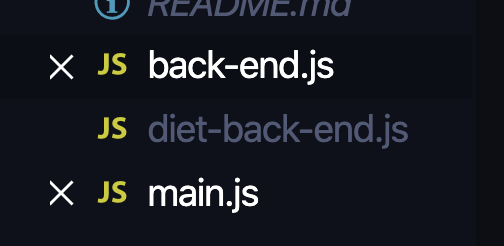
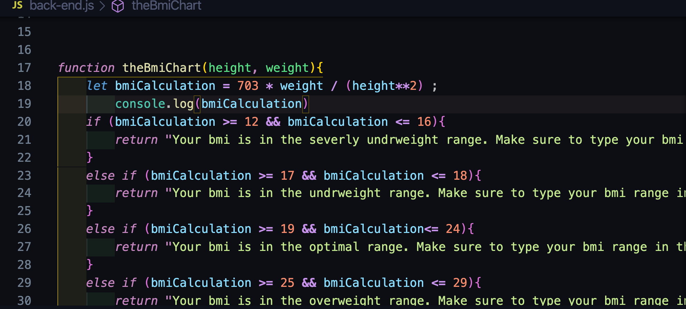
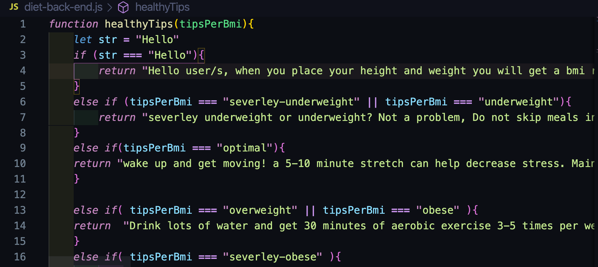
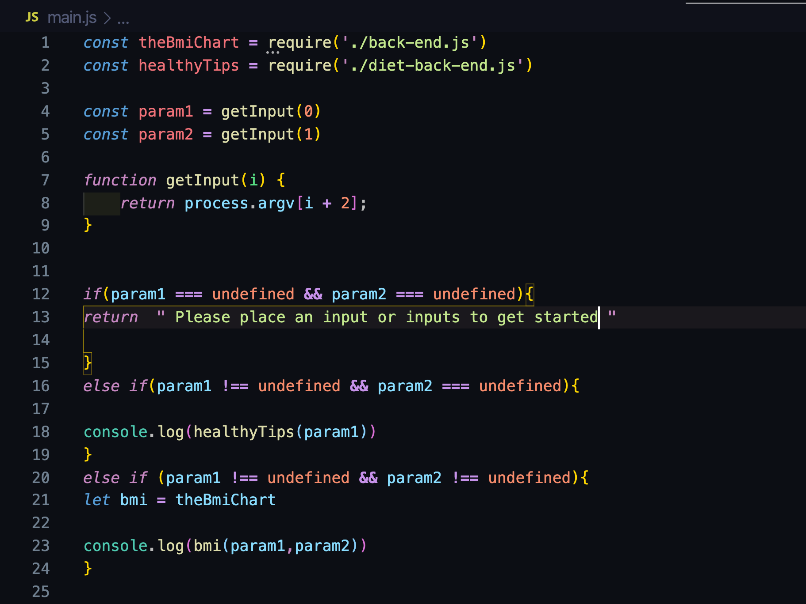

# che BMI app

## BMI app and what it does
            * the BMI app calculates your height and weight and gives a range of the persons body mass index .
            * The Bmi app can give a small healthy tip depending on your bmi

## Getting started
         1. Start by typing Hello (with a capital H)
         2. Enter your weight (just the number in inches) and height (just the number in pounds to find out you BMI ()
        
         3.You can then type your bmi range in the node to get a healthy tip
         

# The process 

### Step 1. create some back-end files and a front end file

            
### Step 2. per file youll want to create a function depending on the out come you want 
#### The back-end file 

#### The diet back-end file 

####  The main.js file

# Stretch goals

        -[ ] 1. Have a second option such as if you enterd you height and weight and got back a bmi my app will later ask "would you like a meal plan?" and if its a yes it will show some options. If no then itll say "Okay"
        -[ ] 2. My node app can suggest youtube videos for workouts"
        -[ ] 3. potential of adding gender. So if you are a man you will have a different diet plan than if youwere a woman. 
        -[ ] 4. Then reply with yes or no if youll like to know what workouts best fit for you.
        -[ ] 5. you can ask for a diet plan by typing diet for this BMI
        -[X] 6. Can suggest a home, studio or Gym 
        -[X] 7. Suggest a eating plan
        -[ ] 8. Workout routine